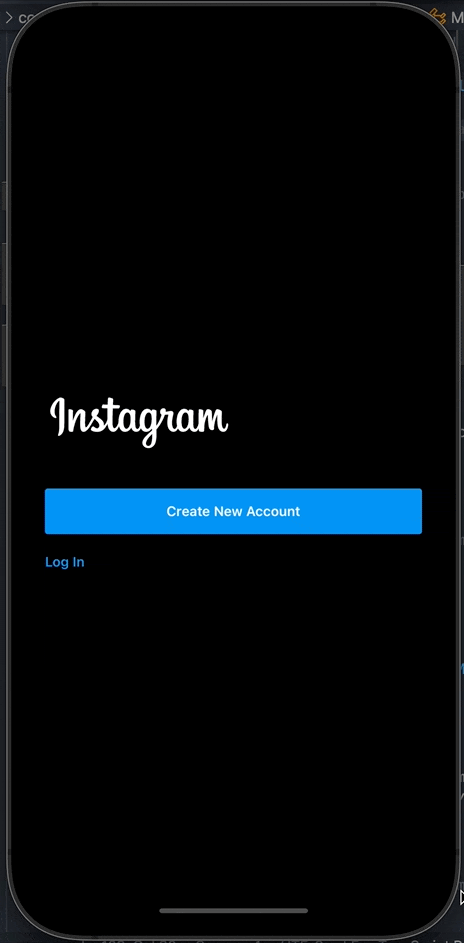
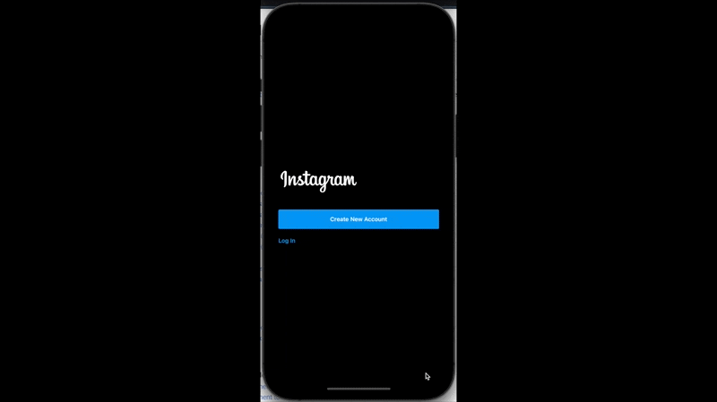
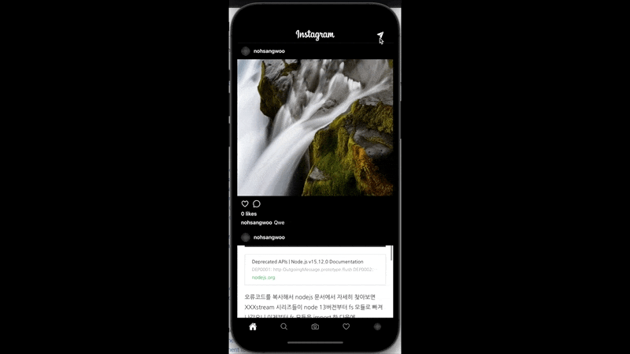

# 기능 구현

## before login home

<div style="display:flex; justify-content:center;">
  
</div>
<br />
<hr />

## Create new account


<br />

<hr />

## Login


<br />
<hr />

## like func


<br />

<hr />

## Ifinite scroll (home screen)


<br />
<hr />

## DirectMessage (realtime - graphql subscriptions)


<br />
<hr />

## Search


<br />
<hr />

## UploadFile


<br />
<hr />

## Take photo (use camera)

- 해당 기능은 실제 폰에서 작동
  (simulator에서 작동 안함)

# Dev logs

## 실리콘 m1용 expo 실행시 세팅방법(watchman 설치법)

- ref : https://chanho-yoon.github.io/silicon%20mac/m1-homebrew/

- expo issue1:

  - 실리콘 맥북용 home brew설치 & 하위 내용 순서대로 CLI 입력

- following commands in the order:

npm install
create-new-account

```
brew update
brew install watchman
expo start
```

And it worked !

<hr />

## App loading...

- ref : https://docs.expo.io/versions/latest/sdk/app-loading/
- 내가 원할때까지 앱 로딩을 막아주는 기능

expo install

```
expo-app-loading
```

## react navigation

- ref : https://reactnavigation.org/docs/getting-started

npm install

```
@react-navigation/native
```

expo install

```
react-native-gesture-handler react-native-reanimated react-native-screens react-native-safe-area-context @react-native-community/masked-view
```

<hr />

## debugging in expo

1. react native tools extension 설치
2. vsc settings에서 react native config에서 port 19001로 변경
3. debugg탭에서 create launch.json 후 devug in Exponent 선택
4. expo 로그인
5. expo start후 앱 실행
6. 이후 콘솔창에서 확인

- ref : https://www.youtube.com/watch?v=9g2_j9U_l2U

<hr />

## stack navigator

npm install

```
@react-navigation/stack
```

<hr />

## Moving Through Screens

- TouchableOpacity
  해당 screen으로 이동하는 방법 중 하나 말그대로 터치하면 살짝 흐려지는 효과와 함께 해당 스크린으로 이동함

# about reactnavigation

- https://reactnavigation.org/

# 14.2 Navigator Props

https://reactnavigation.org/docs/stack-navigator

- initialRouteName
  첫화면의 라우트를 지정할수있음

```
  return (
    <!-- CreateAccount가 가장 첫 화면으로 나오게 만든다 -->
    <Stack.Navigator initialRouteName="CreateAccount">
      <Stack.Screen name="Welcome" component={Welcome} />
      <Stack.Screen name="LogIn" component={LogIn} />
      <Stack.Screen name="CreateAccount" component={CreateAccount} />
    </Stack.Navigator>
  );
```

- mode
  화면이 띄워지는 형식을 지정

```
  return (
    <!-- 새로운 화면이 띄워지는 형식을 바꿈(이경우는 모달형식으로 새창을 띄워라! 기본값은 card형식이다) -->
    <Stack.Navigator mode="modal">
      <Stack.Screen name="Welcome" component={Welcome} />
      <Stack.Screen name="LogIn" component={LogIn} />
      <Stack.Screen name="CreateAccount" component={CreateAccount} />
    </Stack.Navigator>
  );
```

- screen options (하위 route에 옵션을 전체 적용함

````
  <Stack.Navigator
      mode="modal"
      screenOptions={{ headerBackTitleVisible: false }}
    >
      <Stack.Screen name="Welcome" component={Welcome} />
      <Stack.Screen name="LogIn" component={LogIn} />
      <Stack.Screen
        options={{
          headerBackTitleVisible: false,
        }}
        name="CreateAccount"
        component={CreateAccount}
      />
    </Stack.Navigator>
```)
````

# 14.3 Dark Mode

- styled-components in react native expo
  https://styled-components.com/
- 외형을 어떤걸 선택했는지 기억해줌
  https://docs.expo.io/versions/latest/sdk/appearance/

- app.json에 ios 및 android 등의 설정이 기록돼있음

# 14.5 Create Account part One

# expo eject tip1

eject를 할 때, ExpoKit이라는 네이티브 라이브러리를 남겨놓으면 EXPO에 내장된 다양한 React 컴포넌트들을 이용해 네이티브 기능을 쉽게 사용할 수 있습니다. 실제로 꾹꾹이 프로젝트에서도, EXPO의 Google 지도 컴포넌트(<MapView />)를 이용해 빠르게 지도 기능을 구현할 수 있었습니다.

# react native cli setup

https://dev-yakuza.posstree.com/ko/react-native/install-on-mac/

# eject issue

- https://96yj.tistory.com/7

# 14.8 Natural Forms part Two

# 14.9 Login Screen

# TouchableWithoutFeedback 버그 우회

```
<TouchableWithoutFeedback
      style={{ flex: 1 }}
      onPress={dismissKeyboard}
      disabled={Platform.OS === 'WEB'}
    >
```

# 14.10 React Hooks Forms on Native

# 14.11 Apollo Client

# 14.12 Log In Mutation & reactive variable

- 다른 route로 갈때 props를 전달하고 전달 받는 과정 학습
- route로 이동시 props와 함께 전달 하는 방법

```
navigation.navigate('LogIn', {
  username,
  password,
});
```

-

# ngrok or localtunnel

https://ngrok.com/
https://github.com/localtunnel/localtunnel

- 1. https://ngrok.com/download
     ./ngrok http 4000
     or
- 2. npx localtunnel --port 4000

- ActivityIndicator
  로딩애니메이션

# https://reactnative.directory/

- react native directory
  react native에서 사용할수있는 api들을 모아둔 패키지들

# 14.14 AsyncStorage part One

- redux persist 같은 설정
  https://github.com/react-native-async-storage/async-storage 참조
  너무 많이 쓰는 패키지라 공식문서에도 소개됨
  https://docs.expo.io/versions/latest/sdk/async-storage/

# 15.3 Stack and Tabs part Owe

- tab navigation 안에 stack navigation을 쌓고싶을때

# 15.3 Stack and Tabs part Two

실제 작동하게 만들어줌

# 15.4 Apollo Auth

- navigation header에 이미지 삽입
- apollo setting

# 15.5 FlatList

화면에 나타나는 컴포넌트만 일단 렌더링하고 화면의 범위를 넘어서는 부분의 컴포넌트는 스크롤 하는경우에 추가로 렌더링 한다

# 15.6 Photo part One

- component나누고 props전달 방법

# 15.7 Photo part Two

- getSize로 이미지의 실제 크기를 불러와 컨트롤 한다

# 15.8 Photo part Three

# 15.9 Pull to Refresh(Feed.js)

- 화면을 아래로 잡아당겼을때 새로고침되는 것을 말함
- refetch
  이전에 불러온 쿼리를 새롭게 다시 불러오는 기능

# 15.10 Infinite Scrolling part One

- 무한스크롤링 사용법 (Feed의 onReached관련..)
- fetchMore: 말그대로 새로고침하지않고 추가로 더 불러오는 data

# 15.11 Infinite Scrolling part two

- offsetLimitPagination? merge?
- fetchMore로 추가 로드한 부분이 cache에 각각 따로 저장되는 현상을 방지하고
  하나의 데이터로 합쳐지길 원할때

```
cache: new InMemoryCache({
    typePolicies: {
      Query: {
        fields: {
          seeFeed: offsetLimitPagination(),
            // merge 사용방법
          // seeFeed:{
          // existing은 기존 데이터, incomming은 fetchMore로 새로 추가된 데이터
          //   merge(existing = [], incomming = []){
          //     return [...existing, ...incomming]
          //   }
          // }
        },
      },
    },
  }),
```

# 15.12 Cache Persist

persist 적용방법

# 16.0 Likes part One

- feed에서 like 클릭시 parameter를 같이보내기
- 여기서도 새로고침기능 추가

# 16.1 Likes part Two

- ItemSeparatorComponent

```
 <FlatList
  // 아이템 사이에는 적용되지만 맨 위와 맨 아래에는 적용되지 않는 컴포넌트
  // 희미한 seperator선을 만들기 위한 작업
  ItemSeparatorComponent={() => (
    <View
      style={{
        width: '100%',
        height: 1,
        backgroundColor: 'rgba(255, 255, 255, 0.2)',
      }}
    ></View>
```

- and serialize의 bug 수정(app.js)

# 16.2 Header Domination

- navigation.setOptions
  네비게이션과 관련된 옵션을 설정가능(타이틀이나, 색, 정렬 등등..)

# 16.3 Search part One

- TouchableWithoutFeedback
  이부분을 클릭하면 키보드입력창이 비활성화 되게 설정

# 16.4 Search part Two

- useLazyQuery
  보통 쿼리문은 hook을 생성과 동시에 실행되지만
  LazyQuery의 경우 hook생성시 동작트리거를 또 만들어 해당 트리거가 호출되는 시점에서 query가 실행된다

# 16.6 Search part Four

- FlatList - numColumns
  반복되어 렌더링되는 배열의 column 갯 수

# comment 부분 작업 seeComments 작업은 끝냈고 create, delete 작업을 나중에 진행

# 17.0 Modal Navigator

- 기존 tab navigation을 stack navigation으로 또한번 감싸주는 작업
  카메라를 선택시 stack으로 작업하고 싶어서 이런 작업을 진행
  이때 camera가 나타나는 방식이 카드 형태가 아니라 모달 형태로 나타나게 설정
- navigator의 route(props)는 navigation에 접근 가능

# 17.1 Bottom Tabs Navigator

- createMaterialTopTabNavigator
  또다른 네비게이터종류
  https://reactnavigation.org/docs/material-top-tab-navigator/ 참고

# 17.2 Select Photo part One

- navigation option설정

# 17.3 Select Photo part Two

- expo-media-library 세팅
  https://docs.expo.io/versions/latest/sdk/media-library/ 참고
  - media-library사용법
    media-library를 불러오기위해선 권한을 부여받아야함 그 과정을 다룸

# 17.4 Select Photo part Three

- FlatList 적용해서 내 사진첩에 있는 사진 리스트 가져오고 미리보기 작동

# 17.5 Select Photo part Four

- camera - selectPhoto - headerRight를 커스터마이징
- 사진첩에서 로드된 사진을 선택할때 선택된 사진은 표기됨

# 17.6 Take Photo part One

- 사진 찍는 컴포넌트 구현 시작
  https://docs.expo.io/versions/latest/sdk/camera/
  expo install expo-camera
  - 사진 찍는 기능은 시뮬레이터에서 작동안함 진짜 핸드폰에서 사용해야함

# 17.6 Take Photo part One

- 사진 찍기전 권한 요청하는 작업 구현
- 사진 찍는 기능 구현

# 17.7 Take Photo part Two

- 전/후면 카메라 전환기능 구현
- 카메라 줌기능을 위해 슬라이더 라이브러리 사용
  https://docs.expo.io/versions/latest/sdk/slider/
  expo install @react-native-community/slider

# 17.8 Take Photo part Three

- 플래시 기능 켜기 끄기 기능 구현(사진 찍을때)
- 뒤로가기 버튼 이아니라 stack navi 끄고 tab navi로 돌아가는 버튼 생성
- 상단 스테이터스 바 숨기기(selectphoto and take photo)

# 17.9 Take Photo part Four

- expo-file-system
- 사진 찍는 기능 추가(아직 시스템에 저장은 안됨)

# expo camera

https://docs.expo.io/versions/latest/sdk/camera/ 기능 참고

# 17.10 Take Photo part Five

- photo tab 클릭시 사진찍기 기능이 먼저나오게 수정
- 사진을 찍고나서 1.취소 2.업로드 3.시스템에 저장후 업로드 선택하는 메뉴 추가

# 17.11 Take Photo part Six

- 업로드를 위한 폼 정리
- alert사용방법

# 17.12 Upload Screen part One

- 카메라 탭 순서 다시변경 (사진 선택창 먼저 뜨고 그다음슬라이드가 카메라로 사진찍기 창)
- 사진 선택창에서 사진 선택 후 next 버튼 누르면 uploadform으로 넘어가게 설정

# 17.13 Upload Screen part Two

- uploadForm 설정
- 사진 업로드 직전 caption입력과 보낼 form들 설정
- send버튼을 누르면 headerLeft가 사라지게 만들고 로딩표시를 보여주는 기능 구현

# 17.14 Upload Screen part Three

# 17.14 Upload Screen part Three

사진을 업로드 하는 기능 추가(백엔드단에서 aws로 업데이트함)

1. 프론트엔드에서 찍은 사진을 일단 백엔드로 전송
2. 백엔드에서 전송받은 파일을 aws s3에 업데이트후 업로드된 주소를 DB에 저장

- https://www.npmjs.com/package/apollo-upload-client

- onError
  에러를 감지할수있음

# 17.15 Upload Screen part Four

- createUploadLink를 http링크 대신사용해서 json파일로만 통신하는게 아니라 파일도 업로드 할수있게 해줌
  https://www.apollographql.com/docs/apollo-server/data/file-uploads/
- 사진 업로드후 캐쉬업데이트
- 앱에서 cache.modify하는 법
  // 웹처럼 쿼리를 특정하는 id를 따로 지정하지 않고 ROOT_QEURY로 퉁친다
  // 모든 쿼리결과가 ROOT_QUERY에 저장됨

# npm i react-native-uuid

# 18.0 Messages Navigator

- DM 기본 폼 생성(feed에 DM screen으로 갈수있는 버튼 생성)

# 18.1 Rooms Screen part One

- DM페이지로 들어가면 seeRooms쿼리가 실행하고 나와 대화를 진행중이거나 나에게 메시지를 보냈거나 내가 메시지를 보낸 방이 나열된다
- 또한 안읽은 메시지가 있다면 몇개의 메시지가 있는지 카운트 해준다

# 18.2 Rooms Screen part Two

- DM방에 들어가면 로그인한 유저와 관계가 있는 모든 room들을 검색해준다
- 이때 방에 표시되는 아바타 이미지는 내가 아닌 상대방의 이미지가 표시된다
  표시되는 이름또한 상대방의 이름이 표시된다

# 18.3 Room Screen part One

- 컴포넌트 모듈화 및 대화방 입장 기능 구현

# 18.4 Room Screen part Two

- 대화방(room) 꾸미기
- KeyboardAvoidingView
  키보드가 나타날때 화면이 같이 올라가서 키보드가 화면을 가려버리지 않도록 해줌

# 18.5 Room Screen part Three

- 간단한 css정리

# 18.6 Room Screen part Four

- sendMessageMutation 구현 및 캐시 업데이트

# 18.7 Room Screen part Five

- cache를 가지고 장난 치고싶다면 쿼리를 불러올때 항상 id를 같이 불러오면 아폴로가 인식해서 캐쉬에 일단 자동으로 추가는 해준다
- 따라서 쿼리를 불러올때 항상 해당 쿼리의 id를 쓰지 않더라도 그냥 불러오기

# 18.8 Room Screen part Six

- send버튼 icon으로 추가(이때 message input value가 존재하지 않는다면 동작하지 않게 설정)
- DM text를 입력하면 자동으로 맨밑으로 향하게 css적인 설정 추가

# 18.9 Subscriptions part One

- subscriptsions 을 위한 setting up
  https://www.apollographql.com/docs/react/data/subscriptions/#1-install-required-libraries 참고

- wsLink에서 인증처리

# 18.9 Subscriptions part One

- 실시간으로 상대방이 나에게 메시지를 보낸걸 캐치하고 렌더링하기위한 subscriptions 사용

- 근데 기본적으로 useQuery안에 subscribeToMore 라는 기능이 내장돼있음
  이기능은 해당 쿼리를 실행한 데이터가 업데이트 될때마다 실시간으로 받아주는 기능임

# 18.11 Subscriptions part Three

- subscribeToMore이 실행될때 캐시 업데이트 구현
- 메시지가 두번보내지는 버그가 있음

# 18.12 Subscriptions part Four

- 메시지 버그 수정
- 새로받은 메시지가 previous value에 이미 존재하면 업데이트 하지않고 그냥 이전의 값들을 반환한다.
